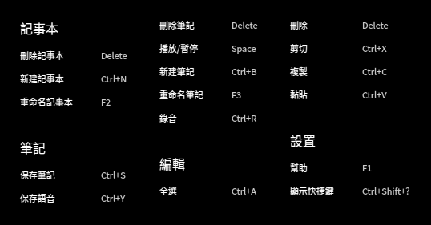
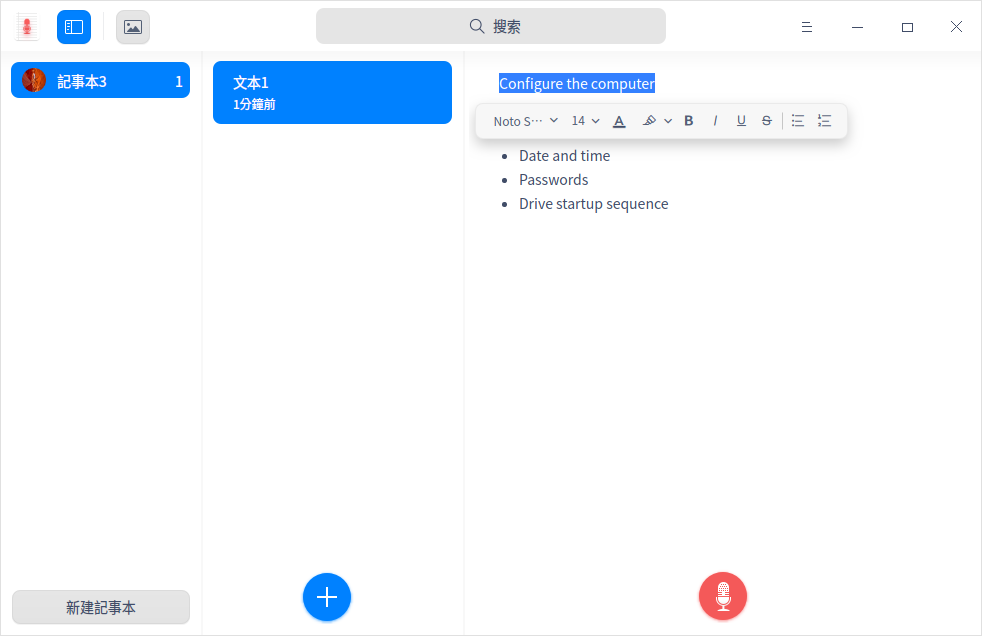
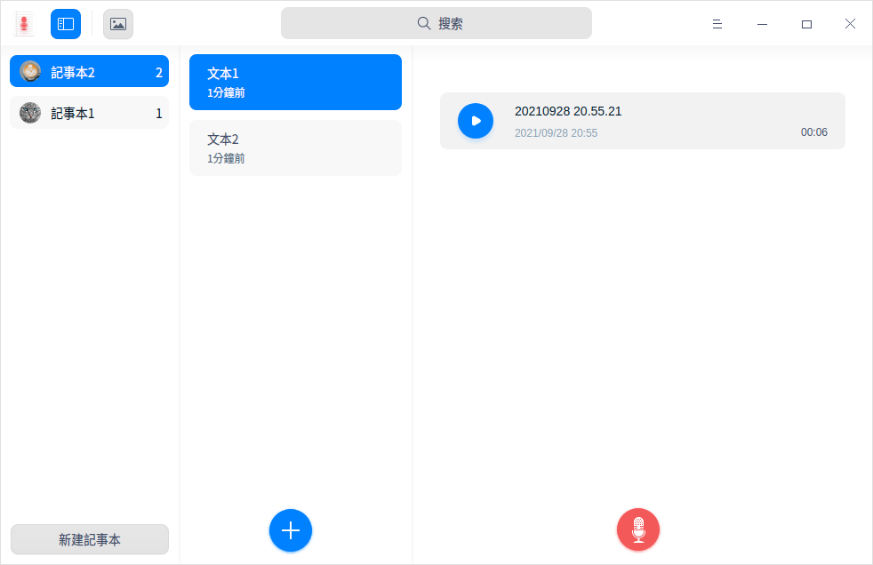
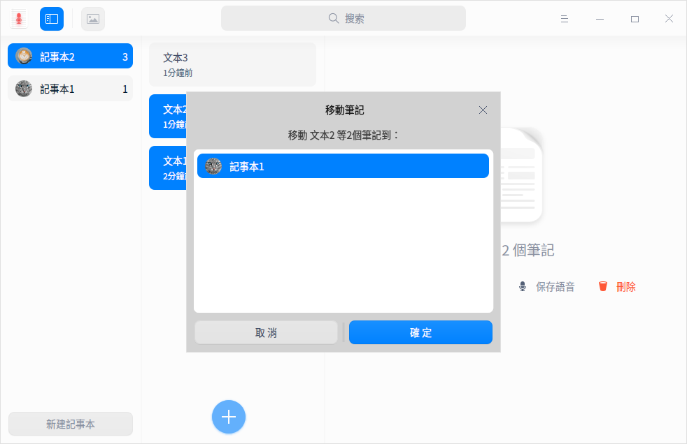
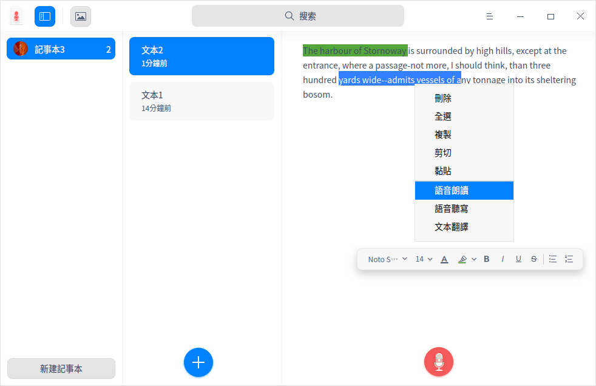
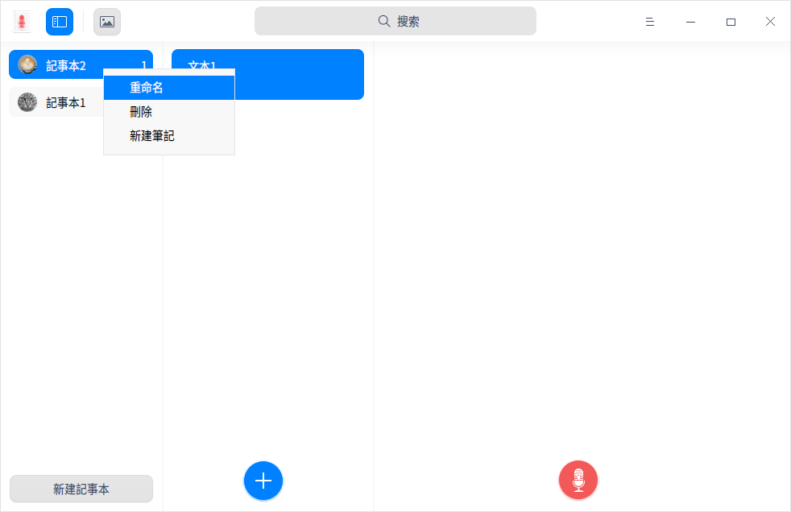

# 語音記事本|deepin-voice-note|

## 概述

語音記事本是一款設計簡潔、美觀易用的記事軟件，支持文字筆記和語音筆記。

## 使用入門

通過以下方式運行、關閉語音記事本，同時還可以創建快捷方式。

### 運行語音記事本

1. 單擊桌面底部的 ，進入啟動器界面。
2. 上下滾動鼠標滾輪瀏覽或通過搜索，找到語音記事本 單擊運行。
3. 右鍵單擊 ，您可以：

   - 單擊 **傳送到桌面**，在桌面創建快捷方式。
   - 單擊 **傳送到任務欄**，將應用程序固定到任務欄。
   - 單擊 **加至開機啟動**，將應用程序添加到開機啟動項，在電腦開機時自動運行該應用。

> 說明：如果語音記事本已經默認固定在任務欄上，您也可以單擊任務欄上的 來運行。

### 關閉語音記事本

- 在語音記事本界面單擊 ，關閉語音記事本。
- 在任務欄右鍵單擊 ，選擇 **關閉所有** 來關閉語音記事本。
- 在語音記事本界面單擊 ，選擇 **退出** 來關閉語音記事本。

### 查看快捷鍵

在語音記事本界面上，按下鍵盤上的 **Ctrl + Shift + ?** 組合鍵來查看快捷鍵，熟練地使用快捷鍵，將大大提升您的操作效率。

 

## 操作介紹

### 新建記事本

- 當語音記事本中尚無記事本時，單擊 **新建記事本**，創建一個新的記事本。
- 在記事本列表下方，單擊 **新建記事本**，創建一個新的記事本。

> 竅門：您可以在記事本列表中拖拽記事本來調整順序。

### 新建筆記

- 當第一次新建記事本後，系統默認創建一個筆記，在筆記列表內單擊  按鈕可繼續創建新的筆記。
- 右鍵單擊記事本或筆記，選擇 **新建筆記** 來創建一個新筆記。

### 添加文字筆記

1. 在筆記列表中，選擇一個筆記。
2. 將光標移入右側詳情頁內，單擊鼠標左鍵後輸入文字筆記。

### 添加語音

1. 在語音記事本界面上，選擇一個筆記。
2. 在右側詳情頁內單擊 ，添加語音。
3. 單擊  按鈕完成語音錄製。
   
   > 說明：添加語音的過程中您可以單擊  按鈕暫停錄音，再次單擊  按鈕繼續錄音。錄音的限制時長為60分鐘。
3. 錄製完成後，單擊  播放按鈕可以回放語音。

### 搜索

1. 在語音記事本頂部搜索框中，單擊 ，輸入關鍵字。
2. 按下鍵盤上的 **Enter** 鍵搜索結果。
3. 在搜索框中單擊  清除當前輸入的關鍵字或取消搜索。

### 移動筆記
在某記事本的筆記列表中，選擇一個筆記或按下 **Ctrl/Shift** 鍵選擇多個筆記，可以採用以下方法之一移動筆記。
- 按住鼠標左鍵將筆記拖拽到另一個記事本中。
- 單擊鼠標右鍵選擇 **移動**，在彈出的對話框中選擇一個記事本，單擊 **確定**，該筆記會移到所選的記事本中。

### 置頂筆記

1. 在筆記列表中，右鍵單擊筆記。

2. 選擇 **置頂**，該筆記會排在筆記列表最前面。

   右鍵單擊已置頂的筆記，選擇 **取消置頂**。

### 語音轉文字

1. 在語音記事本界面上，選擇一個語音文件。
2. 單擊鼠標右鍵選擇 **語音轉文字**。

### 保存語音

1. 在筆記列表中，選擇一個語音筆記或按下 **Ctrl/Shift** 鍵選擇多個語音筆記。
2. 單擊鼠標右鍵，選擇 **保存語音**，選中的語音筆記則保存至儲存設備中。

> 竅門：您也可以選擇語音筆記中某一個語音文件，右鍵單擊選擇 **保存為MP3** ，該語音文件則保存至儲存設備中。

### 保存為TXT文件

1. 在筆記列表中，選擇一個文字筆記或按下 **Ctrl/Shift** 鍵選擇多個文字筆記。
2. 單擊鼠標右鍵選擇 **保存為TXT**，將文字筆記保存至儲存設備中。

### 語音朗讀

在“控制中心” > “輔助功能”中開啟語音朗讀後，可執行以下操作。

1. 在語音記事本界面選中一段文字，單擊右鍵選擇 **語音朗讀**，語音播報選中的文字。
2. 在語音朗讀模式下，單擊右鍵選擇 **停止朗讀** 或者單擊左鍵停止朗讀。

>說明：
>- 當未選中文字時，語音朗讀呈置灰狀態，不可操作。
>- 當只選中語音文件時，語音朗讀不可操作；若語音文件已轉為文字，可選中文字內容進行語音朗讀的操作。

### 語音聽寫

在“控制中心” > “輔助功能”中開啟語音聽寫並選擇語言後，可執行以下操作。

1. 在語音記事本界面右側詳情頁內，單擊鼠標右鍵選擇 **語音聽寫**，通過麥克風輸入語音，轉譯文字將被編輯在詳情頁內。
2. 在聽寫模式下單擊界面空白區域停止語音聽寫。

>竅門：錄製音頻時可同時開啟語音聽寫的功能。

### 文本翻譯

在“控制中心” > “輔助功能”中開啟文本翻譯並選擇語言後，可執行以下操作。

1. 在語音記事本界面選中一段文字。
2. 單擊鼠標右鍵選擇 **文本翻譯**，選中的文字將被翻譯成目標語言。

>說明：當只選中語音文件時，文本翻譯不可操作；若選中的語音文件包含語音轉文字內容，可進行文本翻譯的操作。

### 重命名記事本

新建記事本後，將自動命名為“記事本（n）”，您可以重命名記事本。

1. 在記事本列表中，右鍵單擊記事本。
2. 選擇 **重命名**。
3. 輸入新的名稱。
4. 單擊界面空白處或者按下鍵盤上的 **Enter** 鍵完成重命名。

> 竅門: 您也可以對記事本下的各個筆記進行重命名。

### 刪除記事本

1. 在記事本列表中，選擇一個記事本。
2. 單擊鼠標右鍵選擇 **刪除** 或按下鍵盤上的 **Delete** 鍵 。
3. 在彈出的對話框中，單擊 **確定**。

### 刪除筆記

1. 在筆記列表中，選擇一個筆記或按下 **Ctrl/Shift** 鍵選擇多個筆記。
2. 單擊鼠標右鍵選擇 **刪除** 或按下鍵盤上的 **Delete** 鍵。
3. 在彈出的對話框中，單擊 **確定**。

### 刪除語音

1. 在語音記事本界面上，選擇一個語音文件。
2. 單擊鼠標右鍵選擇 **刪除** 或按下鍵盤上的 **Delete** 鍵。
3. 在彈出的對話框中，單擊 **確定**。

## 主菜單

在主菜單中，您可以設置聲音來源、查看私隱政策、切換窗口主題、查看幫助手冊，了解語音記事本的更多訊息。

### 設置

您可以對聲音來源進行設置，包含系統聲音和麥克風聲音。

1. 在語音記事本界面，單擊 。
2. 設置聲音來源：
   - 選擇 **系統聲音**，錄音時只錄製系統內置聲音。
   - 選擇 **麥克風聲音**，錄音時只錄製麥克風聲音。

### 私隱政策

1. 在語音記事本界面，單擊 。
2. 選擇 **私隱政策**，打開私隱政策鏈接並查看相關內容。

### 主題

窗口主題包含淺色主題、深色主題和系統主題。

1. 在語音記事本界面，單擊 。
2. 選擇 **主題**，選擇一個主題顏色。

### 幫助

查看幫助手冊，進一步了解和使用語音記事本。

1. 在語音記事本界面，單擊 。
2. 選擇 **幫助**。
3. 查看語音記事本的幫助手冊。

### 關於

1. 在語音記事本界面，單擊 。
2. 選擇 **關於**。
3. 查看語音記事本的版本和介紹。

### 退出

1. 在語音記事本界面，單擊 。
2. 選擇 **退出**。

